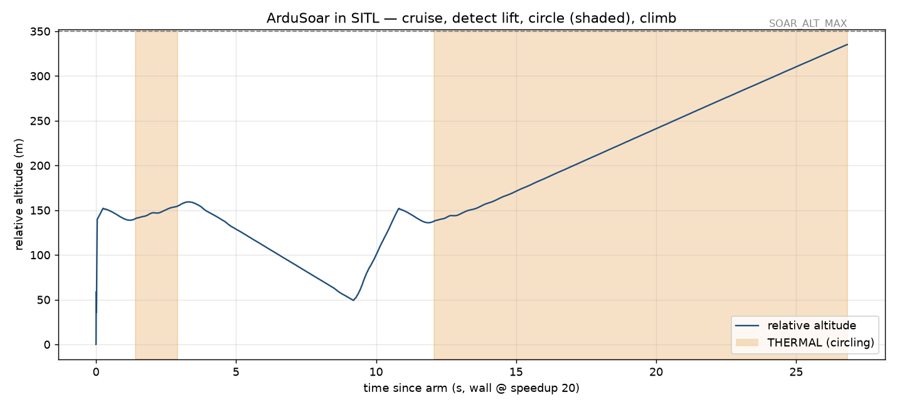

# SITL experiments — reproducing ArduSoar in pure software

**Milestone 1 of the ArduSoar pivot.** This drives ArduPilot's built-in ArduSoar
thermalling controller in SITL (Software-In-The-Loop) over MAVLink, with zero
hardware. It is also the seed of the step-3 weather companion: the same
connect → upload → command → monitor pattern over `pymavlink` is what the
companion will use to push GUIDED waypoints to the real aircraft.



The plane cruises an AUTO mission, ArduSoar detects rising air, switches to
**THERMAL** (LOITER) circling (shaded), climbs toward `SOAR_ALT_MAX`, then
returns to AUTO — exactly the stock ArduSoar behaviour, validated end-to-end.

## One-time setup

ArduPilot lives **outside** this repo (it's large). Built once with:

```bash
git clone --recurse-submodules --depth 1 https://github.com/ArduPilot/ardupilot.git  # → ../../ardupilot
cd ardupilot && ./waf configure --board sitl && ./waf plane
```

Python tooling is in a venv at `../../soar-venv` (Python **3.12** — ArduPilot's
autotest needs ≥3.10):

```bash
python3.12 -m venv soar-venv
soar-venv/bin/pip install pymavlink "empy==3.3.4" pexpect future numpy MAVProxy matplotlib
```

Paths are hard-coded in `run_demo.sh`; adjust if your layout differs.

## Run

```bash
sitl/run_demo.sh            # launches a fresh plane-soaring SITL, runs the demo, tears it down
sitl/plot_soaring.py        # render soaring_demo.png from soaring_log.csv
```

Expected tail:

```
--> Entered THERMAL at 141 m, t=1s
--> Climbed to 335 m (>= SOAR_ALT_MAX-15)
RESULT: PASS
```

## Files

| File | Role |
|---|---|
| `run_soaring_demo.py` | pymavlink driver: upload mission, enable soaring, arm, monitor mode/altitude |
| `run_demo.sh` | orchestrator: fresh SITL up → demo → SITL down |
| `plot_soaring.py` | altitude-vs-time plot with THERMAL segments shaded |
| `soaring_log.csv` / `soaring_demo.png` | last run's data / figure |

## Why not the stock autotest?

`Tools/autotest/autotest.py test.Plane.Soaring` is the authoritative test, but on
macOS its overlapping fence+mission upload races and aborts with
`MISSION_OPERATION_CANCELLED`. We do a single clean mission upload instead.

## Gotcha: enabling soaring headless

`plane-soaring.parm` binds the soaring-enable switch to **RC7 (`RCx_OPTION=88`)**.
In headless SITL that channel boots **LOW**, which latches
`_pilot_desired_state = SOARING_DISABLED` — the plane then just flies the AUTO
mission under power and **never thermals**. A plain `RC_CHANNELS_OVERRIDE` does
**not** reach the aux-switch logic here. The fix is to invoke the aux function
directly:

```python
MAV_CMD_DO_AUX_FUNCTION(param1=88, param2=2)   # 2 = HIGH = auto mode changes
```

The companion (step 3) will rely on this same command to arm soaring on the real
vehicle once it has delivered the aircraft to a forecast hotspot.
